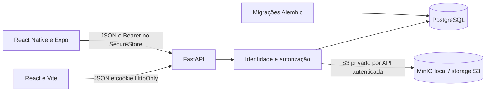
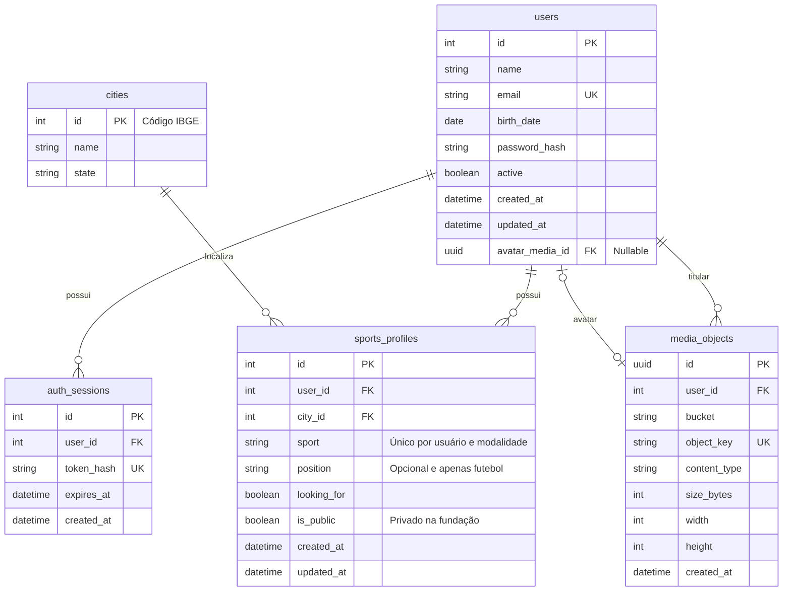

# Arquitetura implementada na fundação

O desenho registra apenas a primeira entrega. Os diagramas PNG do roteiro permanecem referências do MVP futuro.

```mermaid
flowchart LR
    Web[React e Vite] -->|JSON e cookie HttpOnly| API[FastAPI]
    Mobile[React Native e Expo] -->|JSON e Bearer no SecureStore| API
    API --> Services[Identidade e autorização]
    Services --> DB[(PostgreSQL)]
    Services -->|S3 privado por API autenticada| Media[(MinIO local / storage S3)]
    Alembic[Migrações Alembic] --> DB
```

```mermaid
erDiagram
    users ||--o{ auth_sessions : possui
    users ||--o{ sports_profiles : possui
    users ||--o{ media_objects : titular
    users o|--o| media_objects : avatar
    cities ||--o{ sports_profiles : localiza
    users {
        int id PK
        string name
        string email UK
        date birth_date
        string password_hash
        boolean active
        datetime created_at
        datetime updated_at
        uuid avatar_media_id FK "Nullable"
    }
    media_objects {
        uuid id PK
        int user_id FK
        string bucket
        string object_key UK
        string content_type
        int size_bytes
        int width
        int height
        datetime created_at
    }
    auth_sessions {
        int id PK
        int user_id FK
        string token_hash UK
        datetime expires_at
        datetime created_at
    }
    cities {
        int id PK "Código IBGE"
        string name
        string state
    }
    sports_profiles {
        int id PK
        int user_id FK
        int city_id FK
        string sport "Único por usuário e modalidade"
        string position "Opcional e apenas futebol"
        boolean looking_for
        boolean is_public "Privado na fundação"
        datetime created_at
        datetime updated_at
    }
```
